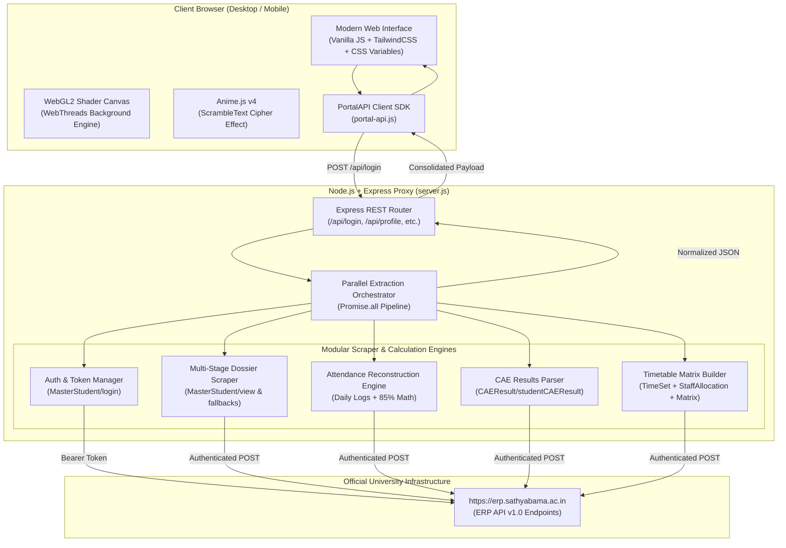

# Sathyabama Institute of Science and Technology (SIST) — Student ERP Portal

<div align="center">


[](https://nodejs.org/)
[](https://expressjs.com/)
[](https://www.khronos.org/webgl/)
[](https://animejs.com/)
[](LICENSE)

<p align="center">
  <b>A high-performance, native-grade modern web portal and reverse-engineered REST proxy for Sathyabama Institute of Science and Technology (Deemed to be University).</b>
</p>

[Key Features](#-key-features) • [Architecture](#-system-architecture) • [Scraper Engine](#-reverse-engineered-scraper-engine) • [UI/UX Innovations](#-uiux--design-innovations) • [API Reference](#-api-reference) • [Getting Started](#-getting-started)

</div>

---

## 📖 Executive Summary

The legacy Sathyabama ERP portal, while comprehensive in institutional records, presents common hurdles for students on daily mobile and desktop devices: sluggish page loads, multi-step navigations, legacy ASP.NET WebForms session limits, and unintuitive mobile browsing.

This project delivers a **ground-up modernization** of the university student experience:
1. **Ultra-Fast Scraper Proxy Backend**: Directly interfaces with Sathyabama's REST API endpoints (`https://erp.sathyabama.ac.in/erp/api/v1.0/`), executing parallelized extraction pipelines to aggregate Student Dossier, Attendance, Continuous Assessment Exam (CAE) marks, and Academic Timetables in **under 700ms**.
2. **Institutional Glassmorphism Client**: Built with pure Vanilla JavaScript (ES6+), custom WebGL2 GPU background shaders, Anime.js v4 cryptographic text scrambling, and tailored desktop/mobile responsive interfaces that match official university standards.
3. **Smart Academic Utilities**: Mathematical attendance clearance calculations (85% university threshold), safe-to-miss vs. required-recovery class projection, timetable day-by-day and weekly grid matrices, and instant profile credential inspection.

---

## ⚡ Key Features

| Module | Features & Capabilities |
| :--- | :--- |
| **🎓 Student Dossier** | Comprehensive civil and academic registration details: Roll Number, Register Number, Department, Batch, Semester, Section, Demographics, Blood Group, Hostel Residency, and Parent/Guardian registry with direct contact cards. |
| **📊 Attendance Clearance** | Real-time calculation against the university's strict **85% eligibility threshold**. Automatically splits Theory and Practical courses, renders daily attendance calendars, and provides proactive warnings (*"Safe to miss X classes"* vs *"Cannot miss anymore class(es)"*). |
| **📝 CAE Exam Results** | Controller of Examinations marks statement for Continuous Assessment Exams (CAE 1 & CAE 2). Features automatic arrear detection, pass/fail status pills, and max/obtained mark tables. |
| **🗓️ Academic Timetable** | Department schedule viewer supporting both **Day View** (with sticky period cards) and **Weekly Grid View** (with frozen day headers and horizontal matrix scrolling), along with a verified Course Instructor & Faculty directory. |
| **📱 Native-App Mobile UI** | Dedicated bottom navigation dock (`Profile`, `Attendance`, `CAE Marks`, `Timetable`), floating identity bar, and touch-optimized layout built with CSS `env(safe-area-inset-bottom)` awareness. |
| **🎨 WebGL2 WebThreads** | Custom GLSL fragment shader rendering interactive sine-wave energy filaments with responsive DPI scaling, touch scroll stabilization, and zero-flicker viewport caching. |

---

## 🏗 System Architecture



---

## 🔍 Reverse-Engineered Scraper Engine

The backend eliminates heavy browser emulation dependencies (like headless Puppeteer/Playwright in production) in favor of high-throughput, native HTTP request pipelining directly to Sathyabama's internal API gateways.

### 1. Direct REST Caller (`erpPostDirect`)
All university interactions are funneled through a resilient fetch abstraction:
- **Headers Mimicry**: Transmits standard Chrome user-agent strings, `Origin: https://erp.sathyabama.ac.in`, and `Referer: https://erp.sathyabama.ac.in/student/view`.
- **Token Injection**: Automatically injects ephemeral authentication tokens across `Authorization: Bearer <token>`, `Access-Token`, and `Token` headers.
- **Timeout Protection**: Guarded by `AbortSignal.timeout(12000)` to handle university server slowdowns gracefully without hanging client connections.

### 2. Multi-Stage Profile Extraction
University records can vary across semesters and departments. The profile scraper employs a 4-tier fallback strategy:
1. **Tier 1**: `MasterStudent/view` querying with `{ StudentId }`.
2. **Tier 2**: `MasterStudent/view` querying with `{ StudentId, RegisterNumber }`.
3. **Tier 3**: `MasterStudent/getstudentbystudentid` with `{ StudentId }`.
4. **Tier 4**: `MasterStudent/getStudentInfoForCerificateGeneration` with `{ SearchNumber: regNumber }`.
5. **Final Fallback**: Normalizes and cleans the raw authentication payload so no profile view is ever blank.

### 3. Attendance Reconstruction Engine
Sathyabama's official ERP calculates attendance using complex Angular client-side logic rather than providing pre-baked statistics. Our engine replicates this algorithm server-side:
- Aggregates `AttendanceDetails` (absent stamps), `HolidayList` (university holidays), `TimetableDetails` (`TimeSetDays`), and `ActualWorkingDays`.
- Evaluates working days chronologically; marks absences against the absent registry and skips recognized holidays.
- Implements the university's **3:00 PM (15:00) cutoff rule** for today's session attendance.
- Computes exact attendance percentage:
  $$\text{Attendance \%} = \left( \frac{\text{Attended Days}}{\text{Total Working Days}} \right) \times 100$$
- Injects recovery intelligence:
  - If $\text{Attendance} \ge 85\%$: Calculates maximum safe classes to miss:
    $$\text{Safe Misses} = \left\lfloor \frac{\text{Present} - 0.85 \times \text{Total}}{0.85} \right\rfloor$$
  - If $\text{Attendance} < 85\%$: Calculates mandatory consecutive classes required:
    $$\text{Classes Required} = \left\lceil \frac{0.85 \times \text{Total} - \text{Present}}{0.15} \right\rceil$$

### 4. Timetable Matrix Reconstruction
The timetable scraper links multiple fragmented institutional tables:
1. Calls `TimetableDetails/getProgrammeSectionAndTimeSetbyCourse` to obtain `TimeTableId` and `ProgrammeSectionId`.
2. Calls `TimeSetSection/getcourseTimeSet` to parse period hours, lunch intervals, and morning break slots.
3. Calls `TimeTableStaffAllocation/getSubjectHandlingStaffs` to retrieve staff associations, cross-referenced with our verified faculty directory.
4. Calls `TimetableDetails/getdatabyprogramme` to compile the complete 5-day weekly grid matrix.

---

## 🎨 UI/UX & Design Innovations

### WebGL2 WebThreads Background
Rather than static images or heavy video loops, the background is powered by a custom WebGL2 fragment shader:
- **Sine Wave Filaments**: Mathematically computed filaments with exponential glow falloff and dynamic alpha blending.
- **Scroll Resizing Stabilization**: Mobile address bars hide and reveal during scrolling, changing `window.innerHeight` by 40–80px. Standard canvas implementations flicker and destroy the WebGL buffer on every resize. Our engine implements a **160px height-delta threshold check**, caching the buffer to `Math.max(curHeight, window.screen.height)` to guarantee **zero buffer resets, zero flickers, and zero curve shifts** while scrolling.
- **Touch Gesture Isolation**: Distinguishes between desktop pointer interaction and mobile touch drag events, preventing touch scrolls from distorting the shader threads.

### Anime.js v4 Cryptographic Text Scrambling
Upon navigating to the Student Dossier, the student's legal name decrypts dynamically via Anime.js v4's `scrambleText`:
```javascript
import { animate, scrambleText } from 'animejs';

animate(targetElement, {
  innerHTML: scrambleText(realStudentName, {
    characters: '0123456789ABCDEFGHIJKLMNOPQRSTUVWXYZ'
  }),
  duration: 900,
  ease: 'outQuad'
});
```

### Native Mobile Stacking Architecture
- **Dedicated DOM Tree**: The mobile bottom navigation bar (`#mobileBottomNav`) is hoisted directly to the `<body>` root with `z-index: 9999 !important`, completely isolated from inner `<main>` container stacking contexts.
- **Click-Through Footer Clearance**: University footers with large bottom clearance margins (`7.5rem`) are styled with `pointer-events: none`, ensuring that all touch events at the bottom of the screen cleanly trigger navigation actions without dead zones.

---

## 📡 API Reference

### 1. Authenticate & Scrape All Data
```http
POST /api/login
Content-Type: application/json

{
  "regNumber": "145111241",
  "password": "YourPassword"
}
```
**Response (200 OK):**
```json
{
  "success": true,
  "token": "eyJhbGciOiJIUzI1NiIs...",
  "student": {
    "name": "GOWTHAM S",
    "regNo": "145111241",
    "department": "COMPUTER SCIENCE AND ENGINEERING",
    "semester": "3",
    "section": "E1"
  },
  "data": {
    "studentDetails": { "name": "GOWTHAM S", "rollNumber": "...", "dob": "...", "fatherName": "..." },
    "attendanceSummary": { "overallPercentage": 88.46, "totalDays": 26, "totalPresent": 23, "totalAbsent": 3, "dailyLogs": [...] },
    "caeResults": { "cae1": [...], "cae2": [...], "arrearDetails": { "totalArrears": 0 } },
    "timetable": { "days": ["Monday", ...], "headers": [...], "schedule": { ... } }
  }
}
```

### 2. Standalone Scrapers
- `POST /api/profile` — Extracts student dossier using `{ token, studentId, regNumber }`.
- `POST /api/attendance` — Reconstructs attendance logs using `{ token, studentId }`.
- `POST /api/cae` — Parses continuous assessment exam marks using `{ token, regNumber, profile }`.
- `POST /api/timetable` — Extracts timetable matrix using `{ token, studentId, profile }`.
- `GET /api/health` — System uptime and health verification.

---

## 🚀 Getting Started

### Prerequisites
- **Node.js**: v18.0.0 or higher
- **npm**: v9.0.0 or higher

### 1. Clone the Repository
```bash
git clone https://github.com/Gowtham-kun/SIST-ERP.git
cd SIST-ERP
git checkout v4
```

### 2. Install Dependencies
```bash
npm install
```

### 3. Launch the Server Locally
```bash
npm start
```
The server will start at:
```text
====================================================
🚀 Sathyabama ERP Pure REST Server running at:
👉 http://localhost:3000
====================================================
```

### 4. Access the Application
Open `http://localhost:3000` in your web browser, enter your official register number and password, and access your student dashboard.

---

## 📂 Project Structure

```text
SIST-ERP/
├── app.js               # Frontend application controller & WebGL/Anime.js logic
├── anime.esm.js         # Anime.js v4 ESM build for high-performance animations
├── favicon.png          # High-resolution university portal icon
├── index.html           # Main semantic HTML5 single-page application shell
├── package.json         # Project manifest, scripts, and runtime dependencies
├── portal-api.js        # Frontend client SDK for communicating with backend API
├── server.js            # Express backend proxy & reverse-engineered scraper engine
├── styles.css           # Custom design tokens, glassmorphism, & mobile navigation rules
├── vercel.json          # Zero-config deployment manifest for Vercel Serverless
└── README.md            # Complete project documentation and architectural guide
```

---

## 🔒 Security & Privacy Notice

- **Zero Credential Retention**: Student passwords and session tokens are **never written to disk, databases, or logs**.
- **Ephemeral Pass-Through**: All credentials are used exclusively in-flight to authenticate directly with Sathyabama's official servers.
- **Client-Side Storage**: Credentials are only stored locally in the student's browser `localStorage` if the **"Remember Me"** checkbox is explicitly selected.

---

## 📄 License

This project is licensed under the [MIT License](LICENSE).

<div align="center">
  <sub>Built with ❤️ for the students of Sathyabama Institute of Science and Technology.</sub>
</div>
